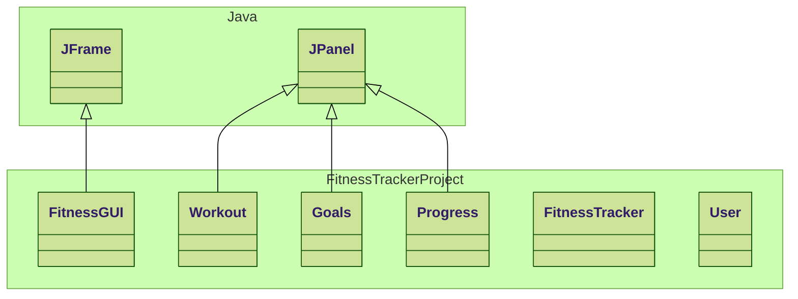

# FitnessTracker
Classes Done:
- User Class.

Classes Work in Progress:
- None.

Good news:
- Changes have made so that it uses multiple windows and it saves code

Bad news:
- To make use of the user class two more classes had to be made

## Class Diagram

