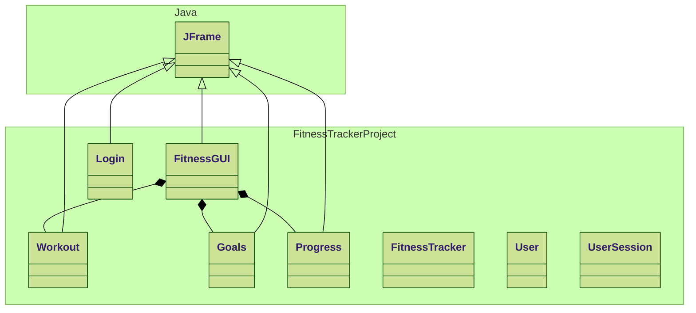

# FitnessTracker

How to run:
1. Make sure you are using a java program
2. Make sure you run the FitnessTracker.java file
3. When closing the window it will close the running program

Classes Done:
- All Classes.
- New Classes have been completed as well.

Classes Work in Progress:
- None.

Good news:
- Changes have made so that it uses multiple windows and it saves uses less code
- Added negative feedback for invalid inputs for all classes in need of it

Not as good news:
- To make use of the user class two more classes had to be added

Newly added code:
- Removal of negative number inputs
- A limit on age to make it ages more realistic

## Class Diagram

