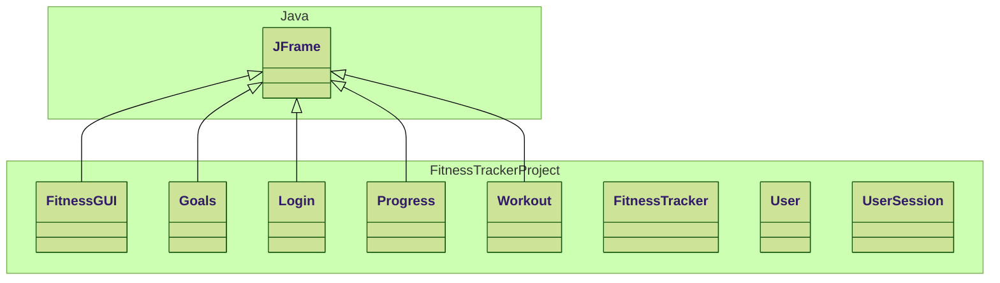

# FitnessTracker
Classes Done:
- All Classes.
- New Classes have been completed as well.

Classes Work in Progress:
- None.

Good news:
- Changes have made so that it uses multiple windows and it saves uses less code

Not as good news:
- To make use of the user class two more classes had to be made

(Please put here if anything you want to add)
Things to add:
- 

## Class Diagram

